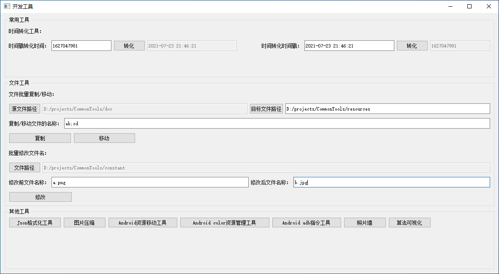
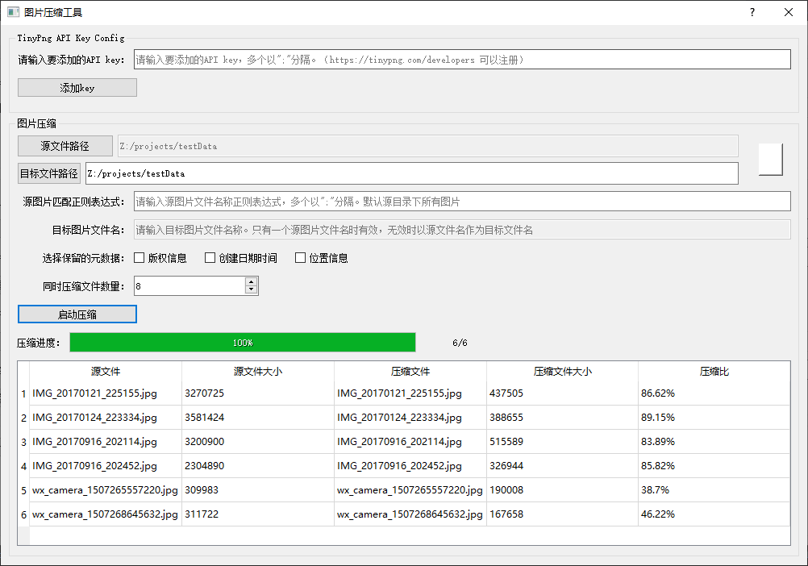
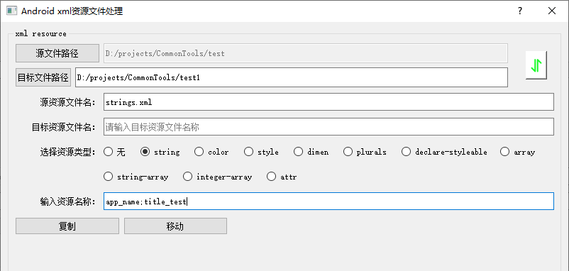
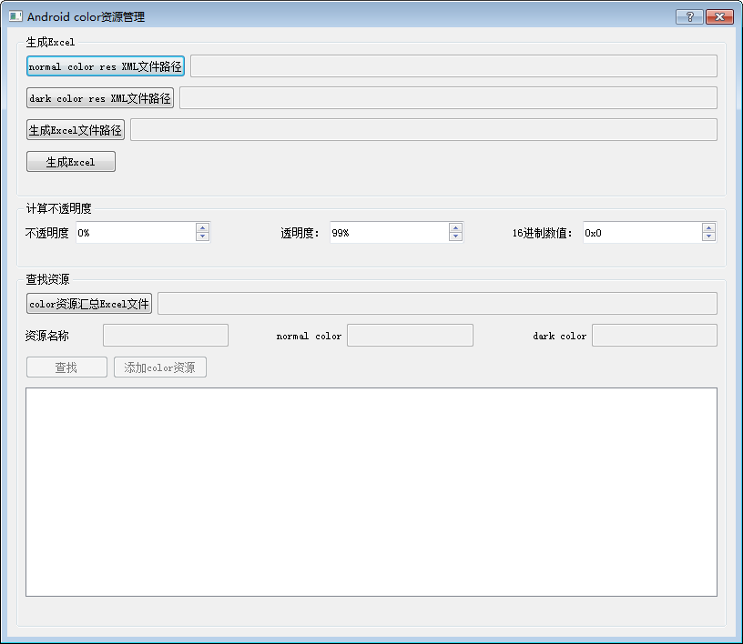
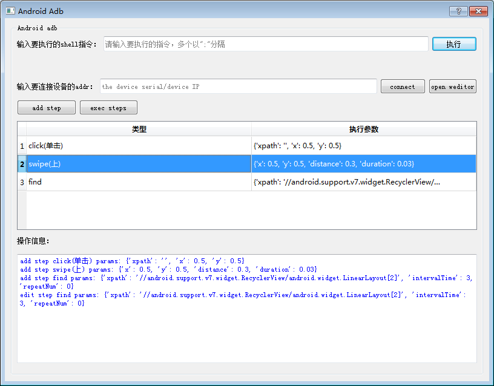
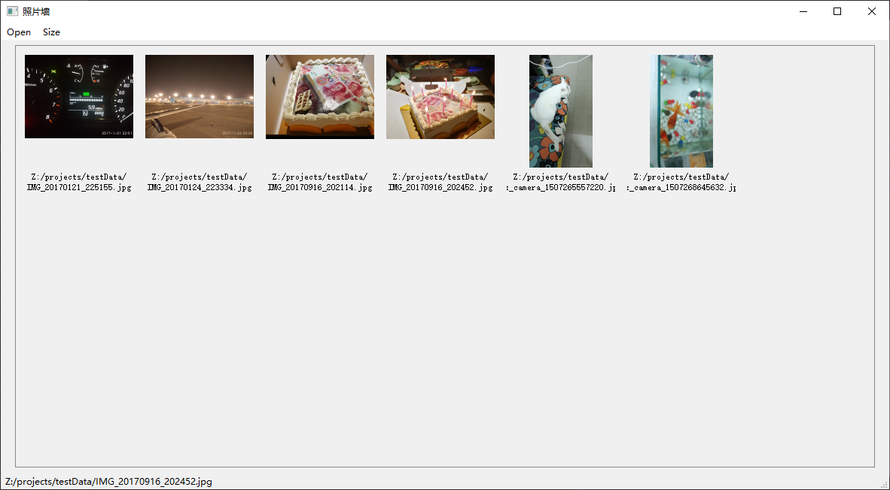
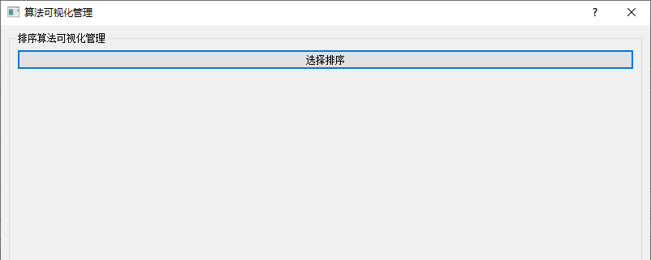
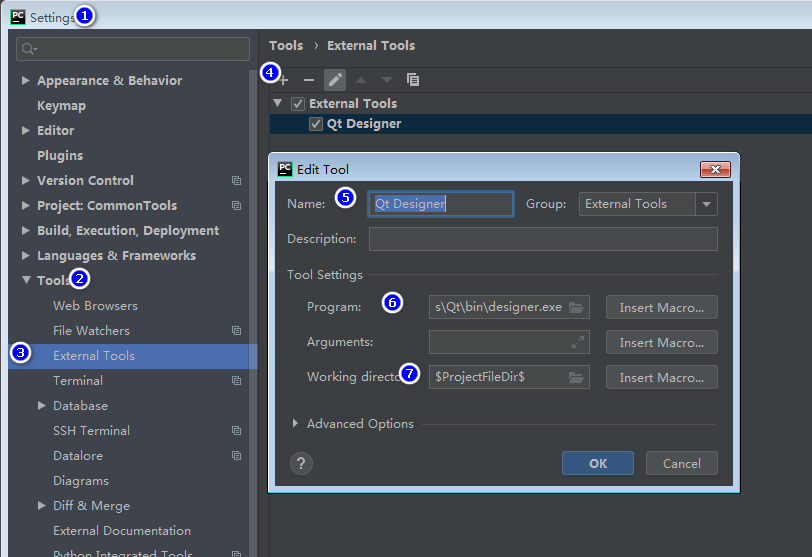

# 概览




图片压缩工具



Android资源文件复制/移动工具：



Android color资源管理工具：



[Android 自动化测试预研：](doc/autoTest.md)



[图片预览](doc/picturePreview.md)



[算法学习](doc/algorithm.md)



# 开发指南

## 环境配置
1、下载PyCharm

[https://www.jetbrains.com/pycharm/download/#section=windows](https://www.jetbrains.com/pycharm/download/#section=windows)

2、下载安装python3

[https://www.python.org/downloads/windows/](https://www.python.org/downloads/windows/)

3、pip安装需要的库

```
pip install wheel PyQt5==5.15.7 PyQt5-tools PyQt5-stubs==5.15.6.0 Pyinstaller xlrd xlutils uiautomator2 numpy QScintilla tinify openpyxl python-docx pyperclip 
--index-url https://pypi.tuna.tsinghua.edu.cn/simple/

pip install weditor==0.6.3 matplotlib

py -3.9 -m pip install pyqt5-tools --index-url https://pypi.tuna.tsinghua.edu.cn/simple/

pip install pycryptodomex -i https://pypi.douban.com/simple 

pip install networkx==2.8.7 pydot==1.4.2 matplotlib==3.6.1 

pip install chardet
```

4、PyCharm配置

设置External Tools


* 设置Qt Designer

Name：Qt Designer

Programs：D:\Program Files\Python39\Lib\site-packages\qt5_applications\Qt\bin\designer.exe

Working directory：$ProjectFileDir$

* 配置PyUIC

Name：PyUIC

Programs：D:\Python\Python38\python.exe

Parameters：-m PyQt5.uic.pyuic  $FileName$ -o $FileNameWithoutExtension$.py

Working directory：$ProjectFileDir$

## 使用Qt Designer
1、点击 Tools -》External Tools -》Qt Designer 启动我们的Qt Designer

## Python项目的打包（Windows）
1、spec文件，见CommonTools.spec

2、pyinstaller CommonTools.spec

## 参考文献

[pycharm如何设置python版本、设置国内pip镜像、添加第三方类库](https://www.cnblogs.com/yjmyzz/p/pycharm-add-third-package-and-add-domestic-mirror.html)

[使用PYINSTALLER打包多文件和目录的PYTHON项目](https://www.cnblogs.com/shiyongge/p/10582552.html)

[PyInstaller Manual](https://pyinstaller.org/en/stable/spec-files.html)

[Python 教程](https://www.w3school.com.cn/python/index.asp)

[Python 正则表达式](https://www.runoob.com/python/python-reg-expressions.html)

[Python 3.6.12 文档](https://docs.python.org/zh-cn/3.6/)

[Qt for Python](https://doc.qt.io/qtforpython/index.html)

[PyQt5 Reference Guide](https://www.riverbankcomputing.com/static/Docs/PyQt5/index.html)

[pyqt5-tools](https://pypi.org/project/pyqt5-tools/)

[PYQT5实现控制台显示功能](https://www.cnblogs.com/gaigaige/p/7883713.html)

[awesome-adb](https://github.com/BlankLun/awesome-adb)

[uiautomator2](https://github.com/BlankLun/uiautomator2)

[web-editor](https://github.com/alibaba/web-editor)

[python中的subprocess.Popen()使用](https://www.cnblogs.com/zhoug2020/p/5079407.html)

[https://tinypng.com/developers/reference/python](https://tinypng.com/developers/reference/python)

[https://www.iconfont.cn/](https://www.iconfont.cn/)

[使用Python 3从网上下载文件](https://blog.csdn.net/xfxf996/article/details/107784224)

[subprocess --- 子进程管理](https://docs.python.org/zh-cn/3.7/library/subprocess.html)

[这40个Python可视化图表案例，强烈建议收藏！](https://mp.weixin.qq.com/s?__biz=MzU5MjI3NzIxMw==&mid=2247503641&idx=1&sn=35507e72d14adb95884b8b29ca38e864&chksm=fe20b4abc9573dbdc384b25ef600466ae8b0f51fbe10cb5ac257915887832184f0d42e5dd621&scene=126&&sessionid=0)

[windows关闭java进程](https://blog.csdn.net/qq_33326449/article/details/80506214)

[Disable output buffering](https://stackoverflow.com/questions/107705/disable-output-buffering)
