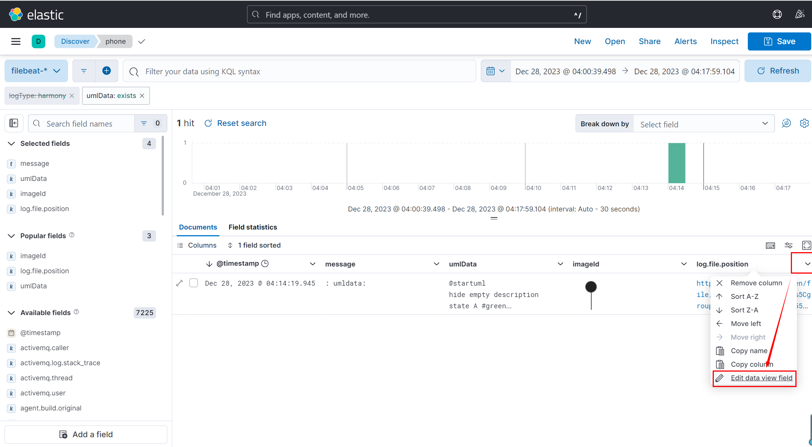
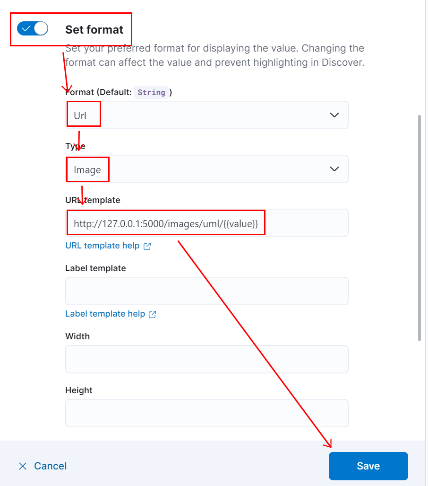

# 编辑Field data view

## 入口

## 编辑Url link数据格式
如下示例，点击field的内容跳转到一个新的url，这里是使用自定义搭建的服务器接口，实现的点击后使用notepad++打开对应的文件功能。

配置内容： 
> http://127.0.0.1:5000/open/file/{{value}}

## 编辑Url Image数据格式
如下示例，对应的filed会显示通过配置url拿到的image数据渲染出对应的图片功能。

配置内容： 
> http://127.0.0.1:5000/images/uml/{{value}}

